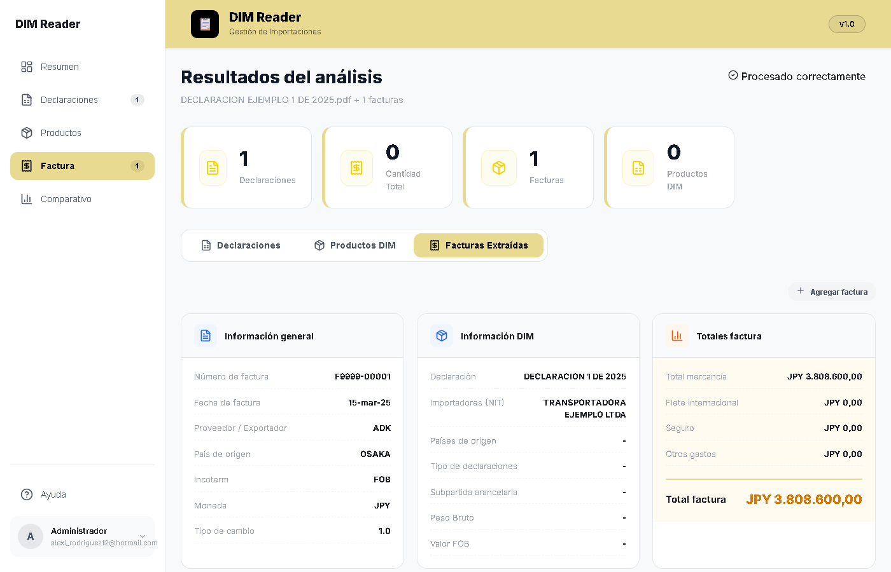
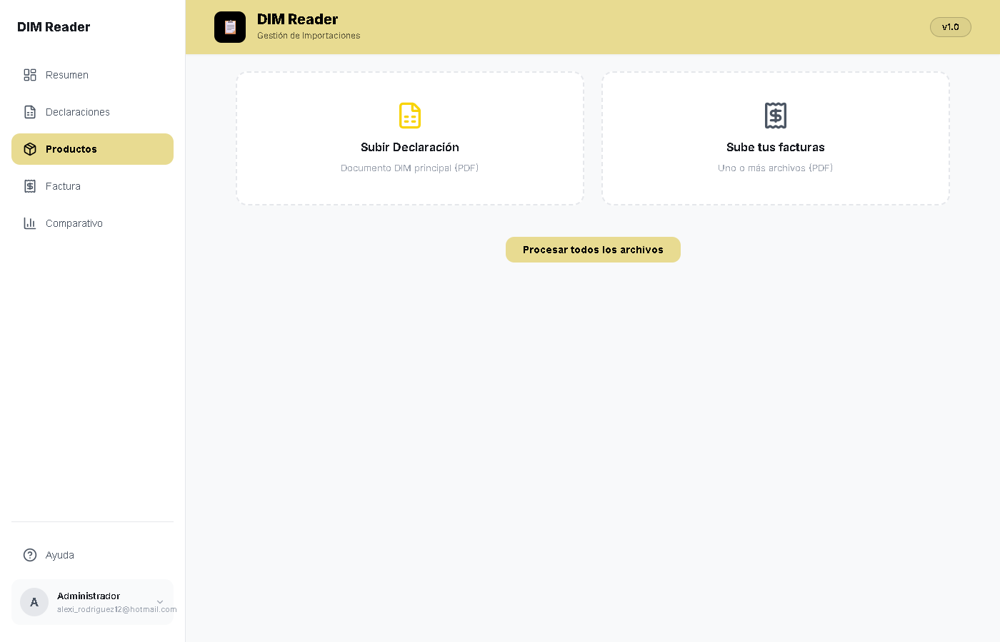

# Lector de Declaraciones de Importación

[](https://www.python.org/downloads/release/python-311/)
[](https://fastapi.tiangolo.com/)
[](https://react.dev/)
[](https://www.docker.com/)
[]()

Sistema automatizado para extraer información de **declaraciones de importación (DIM)** y **facturas proveedor** desde PDFs de formato propietario, y generarla en estructuras Excel listas para el proceso de nacionalización.

Reemplaza la transcripción manual de documentos: sube los PDFs, recibe items, cantidades, valores y metadata de la factura validados contra el mismo documento de origen.

---

## Problemática

Cada despacho de importación viene acompañado de:

- **Declaración de importación (DIM)**: formulario oficial con 90+ columnas (importador, subpartida arancelaria, pesos, valores FOB/USD, fletes).
- **Facturas proveedor**: emitidas por distintos fabricantes con formatos completamente distintos (GATE, SOFABEX, ADK, universales), con precios en moneda extranjera (USD, JPY) y formatos numéricos locales (`12.912.482,00`).

Transcribir estos datos a Excel es lento, propenso a errores y difícil de auditar.

## Solución

Un pipeline automatizado que:

1. Extrae el texto de los PDFs (con fallback a OCR).
2. Detecta el **proveedor de la factura** y aplica su extractor específico (sistema de plugins).
3. Parsea items, cantidades, precios, totales y metadata (num factura, fecha, incoterm, moneda, importador).
4. **Valida la factura**: la suma de los items debe cuadrar con el total del PDF.
5. Expone un frontend React para revisar el resultado y una API FastAPI para integrarlo a otros flujos.

## Capturas




## Arquitectura

Organizado en **Clean Architecture** con capas desacopladas del framework:

```
┌──────────────────────────────────────────────────────────────┐
│  presentation/   FastAPI, rutas, schemas, SPA (React)        │
├──────────────────────────────────────────────────────────────┤
│  application/    Casos de uso (ProcessDocumentsUseCase)      │
├──────────────────────────────────────────────────────────────┤
│  domain/         Entidades, value objects, contratos         │
├──────────────────────────────────────────────────────────────┤
│  infrastructure/ Extractores, PDF, OCR, configuración        │
├──────────────────────────────────────────────────────────────┤
│  core/           Logging, errores, registro de extractores   │
└──────────────────────────────────────────────────────────────┘
```

**Pipeline de procesamiento:**

```
PDF → PDFTextExtractor (pdfplumber → OCR fallback)
      → InvoiceProcessor (detecta proveedor: ADK | GATE | SOFABEX | UNIV.)
        → extraer_metadata + parse de items
          → InvoiceDocument{metadata, items}
            → validación (∑ items == total factura)
              → respuesta JSON / Excel / UI React
```

### Sistema de extractores (plugin-friendly)

| Proveedor | Factura | Particularidades |
|-----------|---------|------------------|
| ADK | Importadora ejemplo | Precios JPY con separador de miles `1.945,00`, códigos alternos, cantidades de 4 dígitos |
| GATE | Facturas línea de correas | `Cantidad Precio Unitario Total` con decimales `7.505` |
| SOFABEX | Facturas en francés | Unidad `O`, descripciones multilingüe |
| Universal | Fallback genérico | `LN CÓDIGO DESCRIPCIÓN CANT PREG EXT` |

## Stack

- **Backend**: Python 3.11, FastAPI, Pydantic v2, pydantic-settings
- **PDF/OCR**: pdfplumber, PyMuPDF, pytesseract
- **Datos**: pandas, openpyxl (Excel)
- **Frontend**: React 19, Vite
- **Calidad**: pytest, black, ruff, isort, mypy (strict)
- **Infra**: Dockerfile multistage, docker-compose

## Empezar

### Backend + Frontend (local)

```powershell
python -m venv .venv
.\.venv\Scripts\Activate.ps1
pip install -r requirements.txt

# Backend (sirve también el frontend compilado)
uvicorn main:app --reload --host 127.0.0.1 --port 8000
```

### Frontend (desarrollo)

```powershell
cd frontend
npm install
npm run dev   # http://localhost:5173
```

### Docker

```powershell
docker build -t lector_declaraciones .
docker run -p 8000:8000 lector_declaraciones
```

## Uso

1. Abrir `http://127.0.0.1:8000`.
2. En **Subir facturas**, adjuntar la declaración (`declaration`) y una o más facturas (`invoices`).
3. Revisar items, cantidades, valores y totales. Los valores se muestran en la moneda original de la factura.

### Endpoint API

```
POST /api/v1/process-multiple
multipart/form-data
  - declaration: PDF de la declaración de importación
  - invoices:    PDFs de facturas (1..n)
```

Respuesta: JSON estandarizado con metadata, items y totales de cada documento.

## Material de ejemplo

La carpeta [`samples/`](samples/) contiene PDFs **ficticios** (sin NIT/RUC/BL reales) para probar el flujo completo, incluyendo una factura ADK con formato real de precios JPY.

## Pruebas

```powershell
pytest
```

## Roadmap

- [x] Refactorización a Clean Architecture
- [x] Extractor ADK con metadata real (moneda, incoterm, importador)
- [x] Validación de cuadratura items ↔ total factura
- [ ] Persistencia de resultados para auditoría
- [ ] Procesamiento asíncrono (Celery/Redis)
- [ ] Nuevos proveedores de factura como plugins